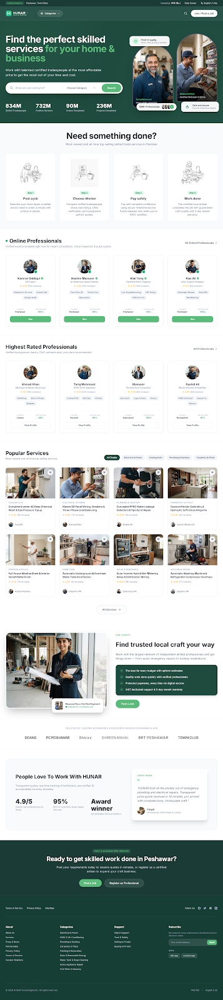

# HUNAR (ہنر) — Design System & Prototype Showcase Hub

An interactive showcase hub and comprehensive UI/UX design system for **HUNAR** — Pakistan's premier on-demand skilled trades, freelance craft, and services marketplace.



---

## 🌟 Overview

This repository houses the complete design prototypes, UI component libraries, and frontend source code for the HUNAR ecosystem across Customer, Worker, and Admin interfaces.

- **Central Showcase Hub (`index.html`)**: Instant catalog of all 64 responsive screens with live search, module filters, responsive device previews (Desktop, Tablet, Mobile), and color system guidelines.
- **Official Design System Tokens (`colors.md`)**: Color palette (Navy `#1A1A2E`, Teal `#0F766E`, Amber `#F59E0B`), typography hierarchy (Inter), and component styling rules.
- **Interactive Worker Portal (`worker_portal/`)**: Vite + React + TypeScript single-page application for skilled workers with job tracking, earnings, and status management.

---

## 📁 Repository Structure

```
├── index.html                                        <-- Central Showcase Hub & Prototype Explorer
├── colors.md                                         <-- Official HUNAR Color System & Design Guidelines
├── landing_page/                                     <-- Main landing page & 37 verified image assets
├── admin_panel/                                      <-- Classic operations admin suite (workers, payments, reports)
├── worker_portal/                                    <-- Interactive Vite + React + TypeScript Worker App
├── admin_operations_suite/                           <-- Analytics, moderation, and settings (Desktop & Mobile)
├── financial_portal/                                 <-- Treasury, ledger, disputes, and payouts (12 screens)
├── marketplace_prototype/                            <-- Customer & worker flows, job posting, GPS map (20 screens)
├── users_management/                                 <-- User directory & customer profiles (4 screens)
├── worker_registration/                              <-- Onboarding wizards, sign-in & OTP verification (8 screens)
└── worker_verification/                              <-- Verification requests & document audit (2 screens)
```

---

## 🚀 Quick Start

### 1. Central Showcase Hub (All 64 Screens)
Simply open `index.html` in any modern web browser:
- Double click `index.html`, or
- Use a local web server:
  ```bash
  npx serve .
  ```

### 2. Running Worker Portal (React App)
```bash
cd worker_portal
npm install
npm run dev
```

To build for production:
```bash
npm run build
```

---

## 🎨 Design System & Palette

| Token | Hex / Value | Description |
| :--- | :--- | :--- |
| **Brand Navy** | `#1A1A2E` | Deep trust foundation, header backgrounds, dark text |
| **Primary Teal** | `#0F766E` | Primary interactive color, CTAs, success states, verified badges |
| **Teal Dark** | `#115E59` | Hover & active states for primary actions |
| **Accent Orange** | `#F59E0B` | Pending status, quotes, ratings, attention badges |
| **Surface Background** | `#F8FAFC` | App canvas & page background |
| **Border Slate** | `#E2E8F0` | Subtle hairline dividers and cards |

---

## 📄 License

Proprietary & Confidential. All rights reserved by HUNAR.
